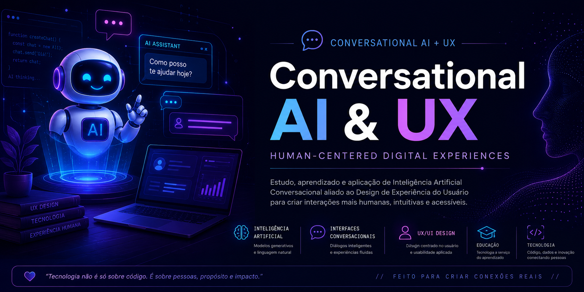

#  AI Conversational UX Guide

---

##  Objectives

- Learn about Conversational AI
- Explore UX in conversational interfaces
- Study Prompt Engineering
- Organize knowledge using NotebookLM

---

##  Sources

- OpenAI Documentation
- Google AI Blog
- NNGroup UX Articles
- IBM Conversational AI Guide

---

##  Prompt Engineering

### Prompt Example
"Explain Conversational AI for beginners."

### Difficulty
The response was too generic.

### Solution
Refined prompts with more context and practical examples.

---

## Structured Summary

Conversational AI combines Artificial Intelligence and natural language interaction to create more human-centered digital experiences.

---

##  Glossary

### Prompt
Instruction sent to AI.

### UX
User experience during interaction with digital products.

### Conversational Interface
System that communicates using natural language.

---

##  Conclusion

This project helped improve:
- AI knowledge
- UX understanding
- Prompt Engineering
- Technical documentation skills
